# Mapa conceptual de `docs/`

**Fecha:** 2026-08-02 · Mapa de los 33 documentos de `docs/`: qué concepto cubre cada uno,
cómo se relacionan y qué autoridad tiene cada uno hoy.

Compañero de [[DOSSIER_DOCUMENTACION_2026-08-02]], que explica **qué está desactualizado**.
Este explica **qué es cada cosa y cómo encaja**.

Leyenda de estado: 🟢 vigente · 🟡 parcial · 🔴 desactualizado · ⚪ histórico.

---

## 1. La idea que ordena todo el mapa

`docs/` no es un cuerpo único. Son **cuatro capas superpuestas**, escritas en momentos
distintos y con autoridades incompatibles:

```
   CAPA 4 · VERDAD ACTUAL (2 agosto)      ← lo que gana hoy
   ────────────────────────────────────
   CAPA 3 · OPERACIÓN (julio)             ← cómo se usa y cómo se vende
   ────────────────────────────────────
   CAPA 2 · SISTEMA NERVIOSO (27-28 mayo) ← el diseño que sí sobrevivió
   ────────────────────────────────────
   CAPA 1 · FUNDACIÓN (24-26 mayo)        ← el plan original, en buena parte muerto
```

Y por debajo de todas, **una quinta capa que no está en `docs/`**: el sustrato canónico,
los cubos y la plataforma multi-tenant, documentados en los 55 `.md` de la raíz del repo y
en `conceptos/`. Esa es la fractura principal.

---

## 2. Mapa general

```mermaid
graph TD
    subgraph C4["CAPA 4 · VERDAD ACTUAL — 2 agosto"]
        DOS["DOSSIER_FUNCIONAMIENTO_INTERNO<br/>cómo funciona por dentro 🟢"]
        AUD["AUDITORIA_2026-08-02<br/>51 hallazgos, qué está roto 🟢"]
        DOC["DOSSIER_DOCUMENTACION<br/>qué doc está caducado 🟢"]
    end

    subgraph C3["CAPA 3 · OPERACIÓN — julio"]
        MAN["MANUAL_KAIZEN<br/>manual del operador + plan S1-S8 🟡"]
        GUI["GUION_VENTA_5_MIN<br/>demo comercial 🟡"]
    end

    subgraph C2["CAPA 2 · SISTEMA NERVIOSO — 27-28 mayo"]
        SN["SISTEMA_NERVIOSO<br/>fundacional M1-M8 🟢"]
        ADR["DECISIONES_ARQUITECTONICAS<br/>7 ADR 🟡"]
        M1["MODELO_DATOS_LEAD · M1 🟡"]
        M2["MAQUINA_ESTADOS_LEAD · M2 🟡"]
        M3["POLITICA_REINTENTOS · M3 🟢"]
        M4["COMPROMISOS_DETECTOR · M4 🟢"]
        M5["BRIEFING · M5 🟢"]
        M6["CONSULTA_NATURAL · M6 🟢"]
        M7["DASHBOARD_DIRECTOR · M7 🟡"]
        M8["SISTEMA_NERVIOSO_M8 🟢"]
        ARG["ARGUMENTARIO_LABORATORIO 🟢"]
    end

    subgraph C1["CAPA 1 · FUNDACIÓN — 24-26 mayo"]
        ARQ["ARQUITECTURA<br/>'fuente única de verdad' 🔴"]
        ROAD["ROADMAP_KAIZEN<br/>9 fases, 0 tags 🔴"]
        PROD["PLAN_PRODUCCION ⚪"]
        DEU["DEUDA_TECNICA 🟡"]
        COM["PLAN_DEPARTAMENTO_COMERCIAL 🟡"]
        VOZ1["PLAN_VOZ_BIDIRECCIONAL 🔴"]
        VOZ2["PLAN_VOZ_CONVERSACIONAL 🔴"]
    end

    subgraph FUERA["FUERA DE docs/ — la quinta capa"]
        CAN["KAIZEN_ARQUITECTURA_CANONICA_v1_0<br/>+ D00…D10 + conceptos/"]
    end

    SES["SIGUIENTE_SESION 🔴<br/>punto de entrada caducado"]

    ROAD -.->|"supera a"| PROD
    ARQ -->|"declara plan vigente"| ROAD
    VOZ2 -.->|"sucede a"| VOZ1
    SN --> M1 & M2 & M3 & M4 & M5 & M6 & M7 & M8
    ADR -->|"justifica"| M1 & M2 & M3 & M4 & M6 & M7
    COM -->|"origen del"| SN
    VOZ2 -->|"origen del"| SN
    MAN -->|"describe"| CAN
    DOS -->|"sustituye a"| ARQ
    AUD -->|"sustituye a"| DEU
    DOC -->|"audita"| C1 & C2 & C3
    SES -.->|"apunta a"| SN

    style ARQ fill:#c62828,color:#fff
    style ROAD fill:#c62828,color:#fff
    style SES fill:#c62828,color:#fff
    style VOZ1 fill:#c62828,color:#fff
    style VOZ2 fill:#c62828,color:#fff
    style DOS fill:#2e7d32,color:#fff
    style AUD fill:#2e7d32,color:#fff
    style DOC fill:#2e7d32,color:#fff
    style CAN fill:#455a64,color:#fff
```



---

## 3. Los seis territorios conceptuales

Otra forma de cortar el mismo conjunto: **por lo que cada documento intenta responder**.

### 🧭 Territorio 1 — «¿Qué es esto y hacia dónde va?»

| Doc | Pregunta que responde | Estado |
|---|---|:---:|
| `DOSSIER_FUNCIONAMIENTO_INTERNO` | Cómo funciona por dentro, hoy | 🟢 **manda** |
| `ARQUITECTURA` | Qué se decidió construir en mayo | 🔴 |
| `ROADMAP_KAIZEN` | En qué orden se iba a construir | 🔴 |
| `PLAN_PRODUCCION` | ¿Es vendible? (veredicto: no) | ⚪ |
| `MANUAL_KAIZEN` | Cómo se usa, en lenguaje llano | 🟡 |

> **Conflicto activo:** `ARQUITECTURA` se declara «fuente única de verdad» y nombra a
> `ROADMAP_KAIZEN` como «plan vigente». Ambos están muertos. La autoridad real es el
> `DOSSIER`, y el plan real es el S1-S8 del `MANUAL_KAIZEN` §12.

### 🧠 Territorio 2 — El sistema nervioso (M1-M8)

La cadena mejor documentada y la única que se lee de principio a fin sin contradicciones.

```
   M1 MODELO_DATOS_LEAD ──► LeadDoc: qué sabemos de un lead
        │
   M2 MAQUINA_ESTADOS_LEAD ──► 12 estados, transiciones cerradas, DO_NOT_CALL terminal
        │
   M3 POLITICA_REINTENTOS ──► cuándo se vuelve a tocar (JSON por empresa)
        │
   M4 COMPROMISOS_DETECTOR ──► qué se prometió en la llamada (LLM)
        │
   M5 BRIEFING ──► qué sabe el agente ANTES de marcar
        │
   M6 CONSULTA_NATURAL ──► "kaizen pregunta …"      ┐ interfaz
   M7 DASHBOARD_DIRECTOR ──► "kaizen comercial dashboard" ┘ humana
        │
   M8 SISTEMA_NERVIOSO_M8 ──► cierra el ciclo con la llamada real
```

Gobernado por `SISTEMA_NERVIOSO` (fundacional) y justificado por
`DECISIONES_ARQUITECTONICAS` (ADR-001 a 007).

**Grietas del territorio:** M1 no documenta `robinson_ok`; M2 no avisa de que existe una
**tercera** máquina de estados en el sustrato; M8 no avisa de que las **firmas de webhook
están rotas** (B-07/B-08), así que el ciclo real no cierra.

### 📞 Territorio 3 — La voz

El territorio con la cadena de sucesión más rota. **Cuatro documentos, tres verdades
distintas.**

```
PLAN_VOZ_BIDIRECCIONAL (26/5) 🔴
    │  recomienda Opción A: ElevenLabs CAI + Twilio nativo
    ▼
PLAN_VOZ_CONVERSACIONAL (26/5) 🔴   ← se declara "sucesor"
    │  recomienda topología B1a: NOSOTROS colocamos la llamada
    │  con Record=true + TwiML <Connect><Stream>
    ▼
VALIDACION_V1_VOZ_BIDIRECCIONAL (27/5) ⚪
    │  ❌ DESMIENTE B1a: el <Connect><Stream> a CAI NO funciona.
    │     La integración real es la API Outbound de ElevenLabs.
    │  ⚠️  Consecuencia: R1 ("grabación garantizada por nosotros") NO se cumple.
    ▼
[ninguno de los dos planes se corrigió nunca]
```

Estado real hoy (Dossier §11 + auditoría B-11): la voz está **bloqueada** porque
`TWILIO_FROM_NUMBER` es un `+1` estadounidense, no conforme a la **Orden TDF/149/2025**.

### 💼 Territorio 4 — El departamento comercial

| Doc | Papel | Estado |
|---|---|:---:|
| `PLAN_DEPARTAMENTO_COMERCIAL` | El diseño. **El plan que sí se ejecutó** | 🟡 |
| `VALIDACION_FASE0_COMERCIAL` | La evidencia de que Fase 0 pasó los gates | ⚪ |
| `REPORTE_FASE0_…1257` / `…1326` | Dos snapshots de máquina, 29 min de diferencia | ⚪ |
| `ARGUMENTARIO_LABORATORIO` | Qué decir, qué no, a quién atacar | 🟢 |
| `CASOS_DE_USO` | Por qué existe el sistema (sin publicar) | 🔴 |
| `GUION_VENTA_5_MIN` | Cómo se enseña a un cliente | 🟡 |

```
Fase 0  ✅ ENTREGADA ── 466 leads · ICP · anillos · enrichment · reporting
Fase 1  ⚠️  A MEDIAS ── email construido → 🔒 cerrado por AI Act (F-01)
                        voz construida   → 🔒 cerrada por numeración ES (B-11)
Fase 2  ⬜ SIN EMPEZAR ─ Account Executive / Manager / Sales Ops
```

### 🧾 Territorio 5 — Deuda y estado

**Tres listas que se solapan.** Fuente de confusión estructural:

| Doc | Alcance | Vigencia |
|---|---|---|
| `AUDITORIA_2026-08-02` | 51 hallazgos, todo el árbol | 🟢 **la que manda** |
| `DEUDA_TECNICA` | 15 ítems de mayo + anexo de julio | 🟡 histórico útil |
| `TODO` | 7 deudas del sistema nervioso | 🟡 no tacha M8, ya entregado |
| `VALIDACION_E2E_REAL` | Gate de Fase 0 nunca ejecutado | 🔴 plantilla vacía |
| `DESARROLLO_RRHH_POSPONER` | Por qué NO se construyó algo | 🟡 |
| `COMO_CREAR_UN_DEPARTAMENTO` | Patrón para construir | 🟡 hoy la unidad es el **cubo** |
| `FINANZAS_SCHEMA` | Caso de estudio del patrón | 🟡 |

### 🚪 Territorio 6 — Puntos de entrada

Dónde empieza a leer alguien que llega nuevo:

| Doc | Para quién | ¿Sirve hoy? |
|---|---|---|
| `SIGUIENTE_SESION` | El operador al abrir sesión | 🔴 **No.** Congelado en el 28/5 |
| `MANUAL_KAIZEN` | El operador, uso diario | 🟡 Sí, con desfase de un mes |
| `SISTEMA_NERVIOSO` | Quien quiera entender el diseño | 🟢 Sí |
| `DOSSIER_FUNCIONAMIENTO_INTERNO` | Quien quiera entender el código | 🟢 **Sí — empezar aquí** |

> **Ruta de lectura recomendada hoy:**
> 1. `DOSSIER_FUNCIONAMIENTO_INTERNO` — qué es el sistema
> 2. `AUDITORIA_2026-08-02` — qué está roto
> 3. `MANUAL_KAIZEN` — cómo se usa (§12: el plan vigente)
> 4. `SISTEMA_NERVIOSO` + M1-M8 — el diseño que sobrevivió
> 5. `DECISIONES_ARQUITECTONICAS` — por qué los diseños raros son así
>
> **No empezar por** `SIGUIENTE_SESION`, `ARQUITECTURA` ni `ROADMAP_KAIZEN`.

---

## 4. Los conceptos del sistema y dónde están documentados

Del concepto al documento. Las filas ⚠️ son las que `docs/` **no** cubre.

| Concepto | Documento en `docs/` | Fuera de `docs/` |
|---|---|---|
| Bus de eventos G1 | `ARQUITECTURA` (parcial 🔴) | `DOSSIER` §6 |
| Lead: modelo de datos | `MODELO_DATOS_LEAD` 🟡 | `DOSSIER` §5 |
| Lead: ciclo de vida | `MAQUINA_ESTADOS_LEAD` 🟡 | `DOSSIER` §7 |
| Reintentos y cadencia | `POLITICA_REINTENTOS` 🟢 | — |
| Compromisos | `COMPROMISOS_DETECTOR` 🟢 | — |
| Briefing pre-llamada | `BRIEFING` 🟢 | — |
| Consulta natural (NLQ) | `CONSULTA_NATURAL` 🟢 | — |
| Cuadro de mando comercial | `DASHBOARD_DIRECTOR` 🟡 | — |
| Cola de aprobación + 5 barreras | — | `DOSSIER` §8.1 |
| Guardián (2 niveles) | `ARQUITECTURA`, `DEUDA_TECNICA` #3 | `DOSSIER` §8.2 |
| ICP, anillos, enrichment | `PLAN_DEPARTAMENTO_COMERCIAL` 🟡 | — |
| Argumentario y Brand Guardian | `ARGUMENTARIO_LABORATORIO` 🟢 | `empresas/laboratorio/brand/` |
| Voz: arquitectura | `PLAN_VOZ_CONVERSACIONAL` 🔴 | `DOSSIER` §11 |
| Voz: pre-flight (11 checks) | — ⚠️ | `DOSSIER` §11 |
| Coste y techos | `FINANZAS_SCHEMA` 🟡 | `DOSSIER` §9 |
| **Sustrato canónico (G3)** | — ⚠️ | `KAIZEN_ARQUITECTURA_CANONICA_v1_0` (raíz) |
| **Cubos y `manifest.json`** | — ⚠️ | `conceptos/CUBOS.md`, `KAIZEN_D00…` |
| **Gates de autonomía** | — ⚠️ | `DOSSIER` §8.3, `sustrato/gates.py` |
| **Comité 3×3** | — ⚠️ | `conceptos/COMITE_3X3.md`, `DOSSIER` §8.4 |
| **OpenGravity (15 roles)** | — ⚠️ | `DOSSIER` §8.5 |
| **Plataforma multi-tenant (G2), RUE** | — ⚠️ | `AUDITORIA_D00.md`, `DOSSIER` §6 |
| **Pánico / PARAR TODO** | — ⚠️ | `DOSSIER` §8.6 |
| **Cadenas de hash (4)** | — ⚠️ | `CADENAS.md` (raíz), `DOSSIER` §12 |
| **Registro P9 (SQLite)** | — ⚠️ | `conceptos/REGISTRO_P9_LEADS.md` |
| **Candado del AI Act** | — ⚠️ | `conceptos/AIACT_GATE.md`, auditoría F-01 |
| **Bucle P8 (argumentario que aprende)** | — ⚠️ | `DOSSIER` §10, `cubos/comercial/p8_bucle.py` |
| **Centro de Mando / Mesa del Jefe** | `MANUAL_KAIZEN` §9 y §12 🟡 | `KAIZEN_D10_CENTRO_DE_MANDO_v0_2` |
| **Lista Robinson / `robinson_ok`** | — ⚠️ | `DOSSIER` §11 (check 7) |

**14 conceptos centrales del sistema no tienen documento en `docs/`.**

---

## 5. Línea de tiempo — cómo se acumuló el archivo

```
24 MAY ─┬─ VALIDACION_E2E_REAL 🔴 (plantilla que nunca se rellenó)
        ├─ FINANZAS_SCHEMA · COMO_CREAR_UN_DEPARTAMENTO · CASOS_DE_USO
        │
25 MAY ─┬─ ROADMAP_KAIZEN 🔴  ← «el plan». 0 tags emitidos, 0 fases cerradas
        ├─ ARQUITECTURA 🔴    ← «fuente única de verdad»
        ├─ PLAN_PRODUCCION ⚪ (se declara superado — el único que lo hace bien)
        └─ DEUDA_TECNICA 🟡
        │
26 MAY ─┬─ PLAN_DEPARTAMENTO_COMERCIAL 🟡  ← EL PLAN QUE SÍ SE EJECUTÓ
        ├─ REPORTE_FASE0 ×2 + VALIDACION_FASE0_COMERCIAL ⚪ (463→465 leads)
        └─ PLAN_VOZ_BIDIRECCIONAL 🔴 → PLAN_VOZ_CONVERSACIONAL 🔴
        │
27 MAY ─┬─ VALIDACION_V1_VOZ ⚪ ← la llamada de 89 s desmiente el plan de voz
        ├─ DECISIONES_ARQUITECTONICAS 🟡 (7 ADR · ninguno posterior)
        ├─ M1 M2 M3 M4 M5 M6 M7 + TODO
        └─ SIGUIENTE_SESION 🔴 ← «próxima sesión: 28 mayo». Se quedó ahí.
        │
28 MAY ─┬─ SISTEMA_NERVIOSO 🟢 + SISTEMA_NERVIOSO_M8 🟢
        └─ ARGUMENTARIO_LABORATORIO 🟢
        │
        ╎  ⟵ ══ DOS MESES DE SILENCIO EN docs/ ══ ⟶
        ╎     (mientras tanto, en la RAÍZ del repo: sustrato canónico,
        ╎      cubos, gates, comité 3×3, RUE, Centro de Mando, AI Act,
        ╎      55 ficheros .md que docs/ nunca menciona)
        │
 3 JUL ─── MANUAL_KAIZEN 🟡 ← el plan REAL (S1-S8) vive aquí, no en el roadmap
 4 JUL ─── GUION_VENTA_5_MIN 🟡
10 JUL ─── corpus_compromisos_c0_v1.json ⚪ (huérfano)
        │
 2 AGO ─┬─ AUDITORIA_2026-08-02 🟢     ← 51 hallazgos · 916 tests · 1 rojo
        ├─ DOSSIER_FUNCIONAMIENTO_INTERNO 🟢 ← la verdad actual
        └─ DOSSIER_DOCUMENTACION 🟢 + este mapa
```

---

## 6. Las tres cadenas de sucesión, y cómo terminó cada una

```
① PLANIFICACIÓN GENERAL
   PLAN_PRODUCCION ──superado por──► ROADMAP_KAIZEN ──✖ MUERTO
                                         │  0 tags v0.x · 0 fases cerradas
                                         ▼
                              plan real → MANUAL_KAIZEN §12 (S1-S8, vence 30 ago)

② VOZ
   PLAN_VOZ_BIDIRECCIONAL ──sucedido por──► PLAN_VOZ_CONVERSACIONAL
                                                   │
                                    ✖ DESMENTIDO por VALIDACION_V1
                                                   ▼
                              verdad actual → DOSSIER_FUNCIONAMIENTO_INTERNO §11

③ ARQUITECTURA
   ARQUITECTURA ("fuente única de verdad") ──✖ SUPERADA sin acta
                                                   │
                          ┌────────────────────────┴──────────────────┐
                          ▼                                           ▼
        DOSSIER_FUNCIONAMIENTO_INTERNO (G1)      KAIZEN_ARQUITECTURA_CANONICA (G3, raíz)
```

**Patrón:** de las tres cadenas, **solo una** (`PLAN_PRODUCCION`) declaró su propia
muerte por escrito. Las otras cinco defunciones son tácitas — y por eso el archivo confunde.

---

## 7. Los números que hay que conocer

| Dato | Valor hoy | Dónde se comprueba |
|---|---|---|
| Tests | **916 passed · 1 failed · 7 skipped** | auditoría §0 |
| Único test rojo | `test_comercial_email_guard` (F-01, AI Act) | auditoría F-01 |
| Leads de Laboratorio | **466** (+28 de `segundo_tenant`) | `DOSSIER` §1 |
| Líneas de código | 46.208 en 345 ficheros | `DOSSIER` cabecera |
| Commits | 66 · **`git tag` → solo `rescate/ddgs-20260524`** | `git` |
| Generaciones conviviendo | **3** (G1/G2/G3) | `DOSSIER` §2 |
| Buses de eventos | 3 · Colas de aprobación: 3 · Contadores de gasto: **4** | `DOSSIER` §2, §9 |
| Máquinas de estados de lead | **3** | ADR-002 + auditoría G-04 |
| Autonomía del cubo comercial | **BAJA** — el comité no decide solo nada | `DOSSIER` §15 |
| Canal email | 🔒 **cerrado en duro** desde hoy (AI Act) | auditoría F-01 |
| Canal voz | 🔒 **bloqueado** (numeración `+1`, Orden TDF/149/2025) | auditoría B-11 |
| Documentos `.md` en `docs/` | 33 · en la **raíz**: 55 | `ls` |

---

## 8. Resumen en una frase

> `docs/` describe con precisión el **sistema nervioso** de KAIZEN y con imprecisión todo
> lo demás: sus dos documentos de autoridad (`ARQUITECTURA`, `ROADMAP_KAIZEN`) están
> muertos sin acta, su punto de entrada (`SIGUIENTE_SESION`) lleva dos meses congelado, y
> **catorce conceptos centrales del sistema —sustrato, cubos, gates, comité, AI Act,
> Robinson— no tienen aquí ni una línea**. La verdad vigente son los dos documentos del
> 2 de agosto, y el resto es historia útil que necesita etiquetarse como tal.

---
Relacionados: [[DOSSIER_DOCUMENTACION_2026-08-02]] · [[DOSSIER_FUNCIONAMIENTO_INTERNO]] · [[AUDITORIA_2026-08-02]] · [[SISTEMA_NERVIOSO]] · [[MANUAL_KAIZEN]]
